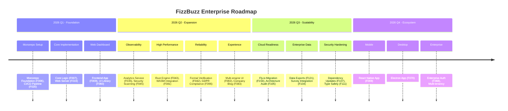
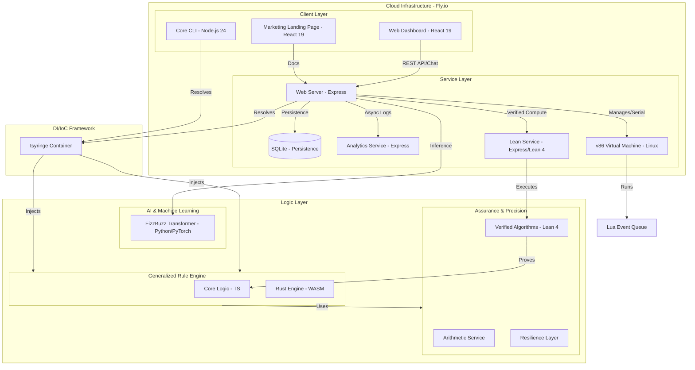

# 🚀 Agent-First FizzBuzz Scalable

[](https://github.com/CamJohnson26/agent-first-fizzbuzz-scalable/actions/workflows/ci-cd.yml)
[](LICENSE.md)
[](https://nodejs.org/)
[](https://pnpm.io/)

---

## 📖 About

**Agent-First FizzBuzz Scalable** is a fully autonomous, AI-developed monorepo project that reimagines the classic FizzBuzz algorithm for enterprise-level scalability. Built entirely by AI agents, this project showcases modern software architecture, formal verification, and automated end-to-end testing in a high-fidelity environment.

This represents a significant milestone in the evolution of software development, demonstrating that AI can autonomously produce production-quality software in a modern monorepo environment with zero human-written code.

---

## 🔄 Replacing Legacy SaaS

Are you tired of bloated, expensive, and unreliable legacy FizzBuzz solutions? **Agent-First FizzBuzz Scalable** is the modern alternative designed to [replace legacy SaaS](https://github.com/EnterpriseQualityCoding/FizzBuzzEnterpriseEdition) with a high-performance, formally verified, and autonomous engine.

---

## 🌐 Live Demo

The **Marketing Landing Page** is automatically deployed to **Fly.io**.

🔗 **[View Live Site](https://agent-first-fizzbuzz-scalable.fly.dev/)**

---

## 🗺️ Project Roadmap

Our project is moving at lightning speed! Here's a look at our past achievements and the amazing features we're bringing to you soon.



---

## 🏛 Architecture Overview

Built on a robust, scalable monorepo architecture using **Turborepo** and **pnpm**. Our system follows a layered approach to ensure separation of concerns and scalability.

### System Diagram



### Component Breakdown

- **`/apps`**:
  - `web-dashboard`: User-facing monitoring and computation interface with data export capabilities.
  - `web-server`: Enterprise API serving FizzBuzz results using multiple high-performance engines, integrated with **SQLite** for local persistence and **v86** for emulated event processing.
  - `lean-service`: Formal verification service wrapping the Lean 4 binary for high-fidelity proofs.
  - `analytics-service`: Centralized log collection and metrics engine for real-time observability.
  - `marketing-landing-page`: High-conversion project showcase with integrated blog and GDPR compliance.
  - `core`: Command-line interface for direct interaction with the FizzBuzz logic.
- **`/packages`**:
  - `core-logic`: The heart of the system, shared TypeScript implementation of FizzBuzz.
  - `rust-fizzbuzz`: High-performance Rust implementation compiled to WebAssembly.
  - `ui`: Shared React component library based on Tailwind CSS 4.
  - `verified-algorithms`: Formally verified implementations in Lean 4.
  - `types`: Centralized TypeScript definitions and API contracts.
  - `config`: Shared ESLint, Prettier, and TypeScript configurations.
- **`/scripts`**: Tooling for environment enforcement, build automation, and security scanning.
- **`/ticketing`**: Our autonomous task management system for tracking AI agent progress.

---

## ✨ Key Features

- 🚀 **Core Rule Model (F007/F124)**: A modular, generalized rule engine that decouples logic, predicates, and renderers (ADR 008, ADR 012).
- 🏎️ **WASM Rust Engine (F043)**: Lightning-fast computations using a specialized Rust implementation compiled to WebAssembly (ADR 009).
- 🛡️ **Lean 4 Formal Verification (F042/F080)**: Mission-critical algorithms formally verified for mathematical precision and reliability.
- 🖥️ **v86 Virtual Machine Isolation (F099)**: Secure, emulated x86 Linux environment for isolated execution and sandbox processing.
- 📪 **v86 Emulated Event Queue (F098)**: Lightweight asynchronous event processing running inside the emulated VM, accessible via serial.
- 🗄️ **SQLite Persistence (F041)**: Enterprise-grade local data storage for computation history, system settings, and audit logs.
- 📊 **Analytics Service (F035)**: Centralized observability and real-time performance monitoring across all services.
- 🧪 **Playwright E2E Testing (F048)**: Comprehensive end-to-end testing suite ensuring reliability across all applications and user flows.
- 📂 **Enterprise Data Exports (F121)**: Seamless export of computation results to CSV, JSON, PDF, TXT, and Excel formats.
- 🍪 **GDPR Compliance (F096)**: Full regulatory compliance with integrated cookie management and automated privacy controls.
- 🤖 **Autonomous Development (F122)**: 100% agent-driven implementation using modern AI-first workflows and automated skills.
- 📦 **Turborepo Monorepo (F006)**: High-performance monorepo foundation with pnpm workspaces and optimized CI/CD pipelines.
- 🎨 **Unified Design System (F028)**: A centralized UI component library using Tailwind CSS 4 and React 19 for consistent UX.
- 📝 **Company Blog (F083)**: Integrated blog platform for project updates, technical articles, and community engagement.
- 🗳️ **Survey Integration (F104)**: Built-in feedback mechanisms and NPS solicitation to drive continuous improvement (ADR 006).

---

## 🛠 Tech Stack

Our system leverages modern, high-performance technologies across the entire stack:

- **Languages**: 
  - **TypeScript**: Primary language for web services and frontend.
  - **Rust**: High-performance engine compiled to WebAssembly for heavy computations.
  - **Lean 4**: Formal verification of core algorithms.
- **Frontend**: 
  - **React 19**: Next-generation UI library.
  - **Tailwind CSS 4**: Utility-first CSS framework for modern styling.
  - **Framer Motion**: Production-ready animations.
- **Backend**: 
  - **Node.js 24**: Stable and secure runtime.
  - **Express**: Fast, unopinionated web framework.
  - **Zod**: Type-safe schema validation.
- **Infrastructure**: 
  - **Turborepo**: High-performance build system for monorepos.
  - **Vercel**: Legacy cloud deployment and hosting.
  - **Fly.io**: Modern persistent VM deployment and hosting.
  - **GitHub Actions**: Automated CI/CD pipelines.
- **Testing**: 
  - **Vitest**: Blazing fast unit and integration testing.
  - **Playwright**: Reliable end-to-end testing for modern web apps.

---

## 🤖 Agent-First Principles

This project is built and maintained by autonomous AI agents. We adhere to strict principles to ensure code quality and scalability:

1. **Mandatory RCA (Root Cause Analysis)**: Any critical bug requires a documented RCA in the `RCAs/` folder.
2. **AI-First Workflows**: Using specialized Agent Skills (like `feature-implementation`) for all development tasks.
3. **Strict Environment Enforcement**: Automated checks ensure all agents work in a synchronized, modern environment.
4. **Collision Prevention**: Mandatory use of `git worktree` and automated PR merging via GitHub CLI.

---

## 🛠 Prerequisites

- **Node.js**: `24.14.1` (Strictly enforced via `.node-version`)
- **pnpm**: `>= 9.15.4` (Managed via Corepack)
- **Docker**: For running the complete service stack.

---

## 🚀 Getting Started

Follow these steps to get the entire FizzBuzz ecosystem running on your local machine.

### 1. Environment Setup

We recommend using a Node.js version manager to ensure you match our strict requirements.

- **NVM**: `nvm install && nvm use` (uses `.nvmrc`)

### 2. Enable pnpm

```bash
npm install -g corepack@latest && corepack enable
# Or as a fallback
npm install -g pnpm@9.15.4
```

### 3. Install Dependencies

From the project root, run:

```bash
pnpm install
```

### 4. Running the Complete Stack (Docker)

The easiest way to see the system in action is via Docker Compose:

```bash
docker-compose up --build
```

This will launch:
- **Web Dashboard**: [http://localhost:5173](http://localhost:5173)
- **Web Server**: [http://localhost:3000](http://localhost:3000)
- **Analytics Service**: [http://localhost:3001](http://localhost:3001)
- **Lean Service**: [http://localhost:3002](http://localhost:3002)
- **Marketing Page**: [http://localhost:8080](http://localhost:8080)

### 5. Running for Development

If you want to run individual apps in development mode:

```bash
# Start the web server
turbo dev --filter @fizzbuzz/web-server

# Start the dashboard
turbo dev --filter @fizzbuzz/web-dashboard
```

---

## 💻 Build and Test

Run the entire pipeline across all packages:

```bash
turbo build
turbo test
turbo lint
```

For individual packages:
```bash
turbo build --filter <package-name>
turbo test --filter <package-name>
```

---

## 🚢 Deployment

The applications in this monorepo are designed for high-availability and scalable deployment.

### Fly.io (All Services)
We use **Fly.io** for hosting our applications and persistent backend services. All applications are automatically deployed to Fly.io via GitHub Actions.

Detailed instructions can be found in the **[Fly.io Deployment Guide](docs/FLY_IO_DEPLOYMENT_GUIDE.md)**.

---

## 🎯 Target Users

- 🎓 **Academia**: Presenting complex algorithmic concepts to graduate students.
- 🧪 **Researchers**: Examining cutting-edge performance and implementation patterns.
- ⚡ **Optimizers**: Experimenting with distributed processing and modular logic.
- 🛡️ **Mission-Critical**: Applying simple, verified modular algorithms to specialized fields.

---

## ✨ Features

- ✅ **Scalable Architecture**: Designed for enterprise-scale distribution.
- ✅ **High-Fidelity**: Precision logic verified by comprehensive test suites.
- ✅ **AI-Enhanced**: Optimized by autonomous agents for various targets.
- ✅ **Modern Tech Stack**: React 19, Tailwind 4, Vite 6, and Node.js 24.

---

## 📝 Development Process (AI-First)

Development is tracked through our custom autonomous ticketing system.

- 🎟️ **[Ticketing Root](ticketing/README.md)**: Entry point for task management.
- 🗺️ **[High-Level Roadmap](ticketing/FEATURES.md)**: Current and planned features.
- 📓 **[Architecture Records (ADR)](docs/adr/)**: Key design decisions.
- 📖 **[Code Conventions](docs/CODE_CONVENTIONS.md)**: Style and standard guides.

---

## 📜 License

Enterprise Proprietary - All Rights Reserved. See [LICENSE.md](LICENSE.md) for details.
