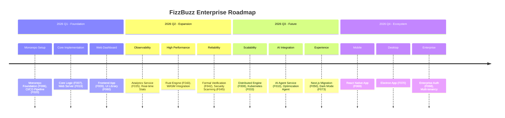
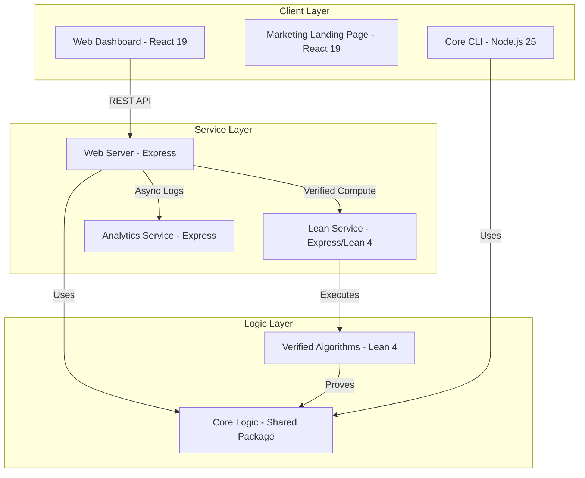

# 🚀 Agent-First FizzBuzz Scalable

[](https://github.com/CamJohnson26/agent-first-fizzbuzz-scalable/actions/workflows/ci-cd.yml)
[](LICENSE.md)
[](https://nodejs.org/)
[](https://pnpm.io/)

---

## 📖 About

**Agent-First FizzBuzz Scalable** is a fully autonomous, AI-developed monorepo project that reimagines the classic FizzBuzz algorithm for enterprise-level scalability. Built entirely by AI agents, this project showcases modern software architecture, formal verification, and automated end-to-end testing in a high-fidelity environment.

This represents a significant milestone in the evolution of software development, demonstrating that AI can autonomously produce production-quality software in a modern monorepo environment with zero human-written code.

---

## 🌐 Live Demo

The **Marketing Landing Page** is automatically deployed to **GitHub Pages**.

🔗 **[View Live Site](https://camjohnson26.github.io/agent-first-fizzbuzz-scalable/)**

---

## 🗺️ Project Roadmap

Our project is moving at lightning speed! Here's a look at our past achievements and the amazing features we're bringing to you soon.



---

## 🏛 Architecture Overview

Built on a robust, scalable monorepo architecture using **Turborepo** and **pnpm**. Our system follows a layered approach to ensure separation of concerns and scalability.

### System Diagram



### Component Breakdown

- **`/apps`**:
  - `web-dashboard`: User-facing monitoring and computation interface.
  - `web-server`: Enterprise API serving FizzBuzz results.
  - `lean-service`: Formal verification service wrapping the Lean 4 binary.
  - `analytics-service`: Centralized log collection and metrics engine.
  - `marketing-landing-page`: High-conversion project showcase.
  - `core`: Command-line interface for direct interaction.
- **`/packages`**:
  - `core-logic`: The heart of the system, shared across all services.
  - `ui`: Shared React component library and design system.
  - `verified-algorithms`: Formally verified implementations in Lean 4.
- **`/scripts`**: Tooling for environment enforcement, build automation, and security.
- **`/ticketing`**: Our autonomous task management system.

---

## ✨ Features Overview

- 🚀 **High-Performance Computation**: Optimized FizzBuzz logic capable of handling massive ranges with minimal latency.
- 📊 **Real-Time Observability**: Integrated analytics service that monitors system usage and performance metrics.
- 🧪 **Comprehensive E2E Testing**: Integrated Playwright test suite for cross-application verification of user flows and backend integration.
- 🛡️ **Formal Verification**: Core algorithms are verified using the Lean 4 theorem solver for mission-critical reliability.
- 🤖 **Autonomous Development**: 100% of the codebase is managed by AI agents, ensuring a consistent and high-fidelity implementation.
- 📦 **Modern Monorepo**: Built with Turborepo for lightning-fast builds and pnpm for efficient dependency management.
- 🎨 **Enterprise UI**: A unified design system using Tailwind CSS 4 and React 19 Server Components.

---

## 🛠 Prerequisites

- **Node.js**: `25.9.0` (Strictly enforced via `.node-version`)
- **pnpm**: `>= 9.15.4` (Managed via Corepack)
- **Docker**: For running the complete service stack.

---

## 🚀 Getting Started

Follow these steps to get the entire FizzBuzz ecosystem running on your local machine.

### 1. Environment Setup

We recommend using a Node.js version manager to ensure you match our strict requirements.

- **NVM**: `nvm install && nvm use` (uses `.nvmrc`)

### 2. Enable pnpm

```bash
npm install -g corepack@latest && corepack enable
# Or as a fallback
npm install -g pnpm@9.15.4
```

### 3. Install Dependencies

From the project root, run:

```bash
pnpm install
```

### 4. Running the Complete Stack (Docker)

The easiest way to see the system in action is via Docker Compose:

```bash
docker-compose up --build
```

This will launch:
- **Web Dashboard**: [http://localhost:5173](http://localhost:5173)
- **Web Server**: [http://localhost:3000](http://localhost:3000)
- **Analytics Service**: [http://localhost:3001](http://localhost:3001)
- **Lean Service**: [http://localhost:3002](http://localhost:3002)
- **Marketing Page**: [http://localhost:8080](http://localhost:8080)

### 5. Running for Development

If you want to run individual apps in development mode:

```bash
# Start the web server
pnpm --filter @fizzbuzz/web-server dev

# Start the dashboard
pnpm --filter @fizzbuzz/web-dashboard dev
```

---

## 💻 Build and Test

Run the entire pipeline across all packages:

```bash
pnpm build
pnpm test
pnpm lint
```

For individual packages:
```bash
pnpm --filter <package-name> build
pnpm --filter <package-name> test
```

---

## 🎯 Target Users

- 🎓 **Academia**: Presenting complex algorithmic concepts to graduate students.
- 🧪 **Researchers**: Examining cutting-edge performance and implementation patterns.
- ⚡ **Optimizers**: Experimenting with distributed processing and modular logic.
- 🛡️ **Mission-Critical**: Applying simple, verified modular algorithms to specialized fields.

---

## ✨ Features

- ✅ **Scalable Architecture**: Designed for enterprise-scale distribution.
- ✅ **High-Fidelity**: Precision logic verified by comprehensive test suites.
- ✅ **AI-Enhanced**: Optimized by autonomous agents for various targets.
- ✅ **Modern Tech Stack**: React 19, Tailwind 4, Vite 6, and Node.js 25.

---

## 📝 Development Process (AI-First)

Development is tracked through our custom autonomous ticketing system.

- 🎟️ **[Ticketing Root](ticketing/README.md)**: Entry point for task management.
- 🗺️ **[High-Level Roadmap](ticketing/FEATURES.md)**: Current and planned features.
- 📓 **[Architecture Records (ADR)](docs/adr/)**: Key design decisions.
- 📖 **[Code Conventions](docs/CODE_CONVENTIONS.md)**: Style and standard guides.

---

## 📜 License

Enterprise Proprietary - All Rights Reserved. See [LICENSE.md](LICENSE.md) for details.
